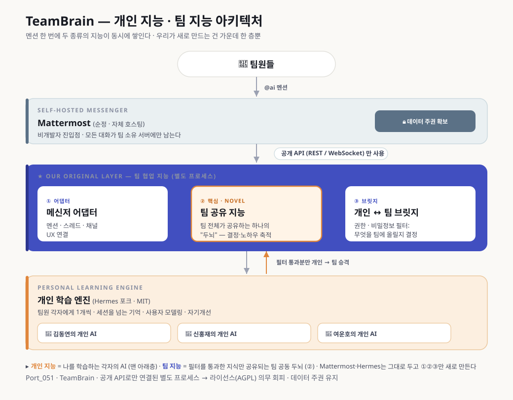

# 2026 AI·SW마에스트로 제17기 프로젝트 기획서 — TeamBrain (초안 v3)

> Port_051 (부산) · 김동연·신홍재·여운호 / 멘토 김선만·강진범·최학열
> 피봇: <마실>(동네 산책 앱) → <TeamBrain>(비개발자 팀 AI 협업 두뇌)
> v3 변경점: 공식 양식(`submission/reference/기획서_원본양식.docx`) 표 구조에 맞춤 + `기획서_TeamBrain_Port051.docx`(기존 제출본)의 다듬어진 문장 채택 + `PLAN.md` Phase 2/7의 세분화된 타겟(자체 메신저 없는 보안 민감 중소기업 / AI 도입 의지 있는 스타트업 — 인터뷰로 확정 예정)을 시장분석·수행방법에 반영.
> `[확인필요]` = 팀 확정 필요 칸.

---

## 1. 프로젝트 요약 (1p)

| 항목 | 내용 |
|---|---|
| **프로젝트명** | (TeamBrain) 팀이 채팅만 해도 저절로 똑똑해지는, 비개발자를 위한 AI 협업 두뇌 |
| **프로젝트 소개** | 팀 메신저에서 AI를 부르기만 하면 대화가 그대로 팀의 자산이 된다. 개발자만 쓰던 "AI에게 시켜 일하기"를 비개발자 팀도 자체 서버 위에서 그대로 쓴다. 팀은 하나의 공유 지능을, 팀원 각자는 나를 아는 개인 AI를 동시에 갖는다. |
| **기술 키워드** | LLM, AI 에이전트, 자기개선형 에이전트, 온프레미스(자체호스팅), 오픈코어 비즈니스모델 |
| **ICT 기술 분류** | ① 인공지능 - ② 활용·지원 AI |
| **팀 명** | Port_051 / **팀 원** 김동연·신홍재·여운호 |
| **목적 및 필요성** | AI를 개인이 각자 흩어져 쓰다 보니 팀의 노하우가 증발한다. TeamBrain은 흩어지는 AI 활용을 쌓이는 팀 지능으로 바꾼다. |
| **프로젝트 개요** | 자체호스팅 메신저와 개인 학습 에이전트를 결합해, 멘션 한 번으로 조사·문서 작성·의사결정 기록까지 끝내는 팀 협업 두뇌. |
| **결과물 활용방안·기대효과** | 오픈소스로 신뢰를 얻고 매니지드 호스팅 구독으로 수익화하는 오픈코어 전략. 자체 메신저가 없는 보안 민감 중소기업, AI 도입 의지가 큰 스타트업이 1차 타겟. |

---

## 2. 프로젝트 기획서 (10p 이내)

## □ 목적 및 필요성

### ㅇ 문제인식

**AI로 조사하고 결론에 이르는 속도는 개인 단위로 이미 빨라졌지만, 그 결과를 팀이 함께 이해하고 합의하는 속도는 전혀 빨라지지 않았다. 팀의 병목이 "정보 부족"에서 "사람 간 합의"로 옮겨갔다.**

- **우리 팀이 직접 겪은 문제**: 프로젝트 주제를 정하는 데만 몇 주가 걸렸다. 아이디어가 없어서가 아니라, 각자 AI로 조사해 도달한 결론을 서로에게 납득시키는 과정이 오래 걸렸기 때문이다. 결론에 이르는 맥락(무엇을 찾아봤는지, 왜 다른 대안은 아니었는지)은 개인 채팅창에만 남고, 팀에는 결론만 말로 전달될 뿐 근거는 전달되지 않는다. 조사(개인 AI 활용)는 몇 시간이면 끝나는데 합의(사람 간 설득)는 몇 주가 걸리는 비대칭이 생긴 것이다.
- **AI는 개인용, 팀은 그대로 깜깜이** — 팀원 각자 ChatGPT·Claude를 따로 쓰다 보니, 정작 팀이 무엇을 알고 있는지는 아무도 모른다. 같은 질문을 두세 번 다시 묻는 일이 반복된다.
- **한 사람이 빠지면 지식도 함께 퇴사한다 (bus factor)** — 담당자가 자리를 비우는 순간 그가 쌓아온 맥락은 통째로 증발하고, 남은 팀원은 처음부터 다시 헤맨다.
- **진입장벽 아니면 정보유출, 둘 중 하나** — git·위키 같은 지식관리 도구는 비개발자에게 문턱이 높고, Slack AI 같은 상용 서비스는 업무 대화가 외부 회사 서버를 그대로 거쳐간다.
- **검증 상태**: 위 문제는 우리 팀(연수생 3인)이 기획 과정에서 직접 겪은 실제 문제다. 일반화 검증을 위해 자체 메신저가 없는 중소기업·AI 도입 의지가 큰 스타트업을 대상으로 인터뷰를 진행 중이다(하단 시장분석·`PLAN.md` Phase 7 참고).

### ㅇ 기획의도

- 팀이 **평소 쓰던 메신저에서 AI에게 말 걸듯** 일하면, 기록·공유·개인화가 **자동으로** 일어나게 한다.
- 엔진을 새로 만들지 않는다 — 이미 검증된 오픈소스 개인 학습 엔진(Hermes)과 메신저(Mattermost)를 그대로 쓰고, 이 둘을 잇는 **"팀 협업 지능 레이어"**라는 아직 세상에 없는 조각만 새로 만든다.

## □ 프로젝트 개요

### ㅇ 프로젝트 소개

팀이 자기 서버에 오픈소스 메신저를 설치하면, 모든 대화는 팀 소유의 서버에만 남는다. 팀원이 채널이나 DM에서 AI를 멘션하는 순간, 그 대화와 결정은 자동으로 기억되어 팀 전체가 공유하는 지능이자 나를 학습하는 개인 에이전트로 동시에 쌓인다.

### ㅇ 주요 기능

| 기능 | 설명 |
|---|---|
| 주요 기능1 — 메신저 내 AI 작업 수행 | Mattermost에서 AI를 멘션하면 자료 조사·문서 작성·파일 수정까지 그 자리에서 끝난다. 외부 AI 사이트를 오갈 필요가 없어, 일의 과정과 결과가 그대로 팀의 기록으로 남는다. |
| 주요 기능2 — 팀 공유 지능 | 한 팀원이 AI와 나눈 대화에서 얻은 답을, 다른 팀원이 자신의 AI에게 물으면 그대로 알려준다. 권한·비밀정보 필터를 통과한 지식만 공유된다. |
| 주요 기능3 — 개인 학습 에이전트 | Hermes의 세션을 넘는 기억과 사용자 모델링으로, 개인 에이전트가 각자의 업무 스타일과 맥락에 맞춰 스스로 발전한다. |

### ㅇ 시장분석

기존 대안은 뚜렷한 두 갈래로 나뉜다.
- **① 상용 올인원**(Slack AI · MS Copilot · Notion AI) — 강력하지만 데이터가 외부 서버를 거치고, 구독료가 팀 규모에 비례해 계속 늘어난다.
- **② 오픈소스 메신저**(Mattermost · Rocket.Chat) — 자체 호스팅은 되지만 AI는 단순 응답 봇 수준이라 "팀이 똑똑해지는" 경험은 없다.

TeamBrain은 데이터 주권을 지키면서도 팀과 개인이 함께 똑똑해지는 협업 지능, 그 둘 사이의 빈틈을 겨냥한다.

**1차 타겟은 두 후보군을 병행 검증 중이다** (인터뷰 5건 후 확정 예정):
- **후보 A — 자체 메신저가 없는 보안·기밀 민감 중소기업**: 연구실·로펌·병원·제조업(도면 관리) 등. 이들에게 TeamBrain은 "메신저 교체"가 아니라 "신규 도입"이라 저항이 적다.
- **후보 B — AI 도입에 적극적인 스타트업·중소기업**: 잦은 퇴사·인수인계로 인한 지식 유실 부담, 인건비 절감 니즈가 도입 동인.
- 두 조건이 겹치는 조직(자체 메신저 없음 + AI 도입 의지 있음)이 최우선 후보다. 소마 인증 관점에서는 판매 성사 여부와 무관하게 **파일럿 기업 2~3곳 확보**를 1차 목표로 삼는다.

### ㅇ 시스템 구성도

팀원이 자체 호스팅 메신저에서 AI를 멘션하면, 공개 API로 연결된 개인 학습 엔진(Hermes 포크)이 메신저 연동과 세션을 넘는 기억·사용자 모델링·자기개선을 그대로 맡는다. 그 위에 공식 확장 지점을 통해 우리 원본 레이어(팀 협업 지능 레이어·개인↔팀 지식 브릿지)가 꽂혀, 팀 전체가 공유하는 지식 저장소를 만들고 관리한다. 메신저·개인 학습 엔진은 검증된 오픈소스를 그대로 활용하고, 우리가 새로 만드는 부분은 이 팀 협업 지능 레이어에 집중된다.

### ㅇ 개발환경

| 구분 | 항목 | 세부 |
|---|---|---|
| SW | OS | Ubuntu Server (배포용), macOS/Windows (개발용) |
| SW | 개발도구 | VS Code, Docker, Git/GitHub, Claude Code |
| SW | 개발언어 | Python (에이전트 엔진 연동), TypeScript (대시보드·랜딩페이지) |
| AI | 사용모델 | Claude·GPT·Gemini 혼용 (경량 라우팅으로 비용 최적화) |
| AI | 활용방식 | 메신저 멘션 → 에이전트 응답·조사·파일 생성/수정 → 자동 기억·개인 학습 |
| AI | 기타(기자재 등) | 해당사항 없음 |

### ㅇ AI 활용 전략

AI는 대화 응답에 그치지 않는 제품의 본체다. 조사·파일 생성·수정을 직접 수행하고, 자기개선(경험 → 스킬 생성·개선)과 세션을 넘는 기억·사용자 모델링으로 쓸수록 더 정교해진다. 초기에는 범용 LLM(Claude·GPT·Gemini 혼용, 경량 라우팅으로 비용 최적화)으로 시작하고, 데이터가 쌓일수록 개인·팀 전용 모델로 정밀화한다.

## □ 프로젝트 수행 방안

### ㅇ 팀 구성 및 역할

| 구분 | 팀원 | 담당 역할 |
|---|---|---|
| 연수생 | 김동연 | **메신저·인프라** — 메신저 연동 설정, 자체호스팅·매니지드 배포(Docker) 총괄 |
| 연수생 | 신홍재 | **팀 협업 지능 레이어** — 개인↔팀 지식 통합·권한/비밀 필터 설계, 대시보드 프론트 |
| 연수생 | 여운호 | **AI 엔진 연동** — 개인 학습 에이전트 포크·응답·기억/학습 루프 설계 |

### ㅇ 멘토 구성 및 역할

| 구분 | 멘토 | 주요 활동 |
|---|---|---|
| 멘토 | 강진범 | 실무 적용 관점의 MVP 기능 우선순위·사용성 검증 지도 |
| 멘토 | 김선만 | AI 에이전트·시스템 아키텍처, 오픈소스 전략과 사업화 방향 지도 |
| 멘토 | 최학열 | AI 기술 타당성 검증 — 핵심 기술 챌린지(프라이버시 필터·지식 체계화 엔진) 설계 자문, 경쟁·타겟 시장 전략 자문 (`meetings/2026-07-07_최학열-멘토링.md`) |

### ㅇ 추진 일정

| 구분 | 추진 내용 | 5월 | 6월 | 7월 | 8월 | 9월 | 10월 | 11월 |
|---|---|---|---|---|---|---|---|---|
| 기획 | 요구사항 정리·아키텍처 확정 | - | - | → | - | - | - | - |
| 분석 | 문제·시장 분석, 기술 조사 | - | - | → | - | - | - | - |
| 설계 | 시스템 아키텍처·에이전트 설계 | - | - | → | - | - | - | - |
| 개발 | MVP 개발 — 메신저 연동 + AI 에이전트 + 매니지드 배포 | - | - | → | → | - | - | - |
| 테스트 | 내부 배포·도그푸딩·B2B 파일럿·1차 피드백 반영 | - | - | - | → | → | - | - |
| 완성 | 오픈소스 공개·고도화·완성 | - | - | - | - | → | → | → |

### ㅇ 수행 방법

- **개발**: 메신저 순정 설치 → 봇 계정 연결 → 개인 학습 엔진(Hermes)의 공식 확장 지점에 팀 협업 지능 레이어 구축 → 매니지드 배포 순으로 진행한다.
- **사용자 확보 (0차 → 1차 → 확산 순)**:
  1. **0차 — 소마 내부 도그푸딩**: 소마 연수생·멘토 대상 우선 배포해 우리 스스로 매일 쓰며 기술·UX를 빠르게 검증한다 (단, 이 그룹은 AI·개발 친화적이라 시장 증거로는 쓰지 않는다).
  2. **1차 — B2B 파일럿 확보**: 자체 메신저가 없는 보안 민감 중소기업(연구실·로펌·병원·제조업)과 AI 도입 의지가 큰 스타트업, 두 후보군을 대상으로 파일럿 기업 2~3곳과 실사용(무료 베타 포함)을 확보해 실제 시장 신호를 검증한다.
  3. **확산 — 오픈소스 공개**: repo 정리 후 공개해 개발자 커뮤니티로 확산한다.
- **커뮤니티/마케팅**: 오픈소스 기여자 커뮤니티 자체를 TeamBrain 위에서 운영해(제품이 곧 그 커뮤니티의 협업 도구가 되도록) 가장 강력한 데모로 삼고, 소개 랜딩페이지로 유입시켜 self-host 사용자 중 호스팅 수요층을 매니지드 구독으로 전환한다.

### ㅇ 예상문제 및 해결방법

| 구분 | 문제점 | 해결방안 |
|---|---|---|
| 개발 측면 | 개인 학습 엔진에 팀 협업 지능 레이어를 안정적으로 연동하는 방식이 아직 실증되지 않음 | 공식 확장 인터페이스를 활용해 소규모 프로토타입으로 먼저 검증한 뒤 본 개발 착수 |
| 프로젝트 관리측면 | 개인↔팀 지식의 권한·비밀 경계 관리 | 공유되기 전 단계에서 비밀정보를 걸러내는 필터링 레이어를 설계 |
| 상용화 측면 | 상시 AI 호출에 따른 토큰 비용 누적 | 저비용 모델 혼용과 캐싱으로 원가를 낮추고, 매니지드 요금제에 반영 |
| 기타 | 오픈소스 라이선스(AGPL) 리스크 | 메신저 소스는 수정 없이 별도 프로세스로만 연동하고, 원저작권 고지를 유지해 리스크를 원천 차단 |

## □ 결과물 및 기대효과

### ㅇ 결과물 형태

웹/서버 기반 플랫폼 — 팀이 자기 서버에 직접 설치해 실제로 구동하는 완결된 서비스형 결과물이다.

### ㅇ 결과물 활용방안

- 오픈소스로 무료 공개해 누구나 자기 서버에 설치할 수 있게 하고, 직접 호스팅이 번거로운 팀에는 매니지드 호스팅 구독(설치·운영 대행)을 유료로 제공하는 오픈코어 사업모델이다. `[확인필요: 구체 요금 — 팀당 월 요금대 확정]`
- 잠재 고객은 자체 메신저가 없어 데이터 주권이 중요한 규제·보안 민감 소규모 조직(연구실·로펌·병원·제조업 등)과, 퇴사·인수인계 부담이 큰 AI 도입 의지 있는 스타트업·중소기업 두 갈래다.

### ㅇ 기대효과

| 측면 | 내용 |
|---|---|
| 사용자 | 업무 지식이 대화 속에 자동으로 쌓여 흩어지지 않는다. 지난 결정과 이유를 검색 한 번으로 찾고, 새 팀원 온보딩 시간이 크게 줄며, 개인 에이전트가 내 업무 스타일을 학습해 쓸수록 더 잘 맞는 비서가 된다. |
| 비즈니스 | 오픈소스로 신뢰와 기여자를 모으고, 매니지드 호스팅 구독으로 반복 매출을 만든다(오픈소스→신뢰→구독 선순환). 데이터가 회사 밖으로 나가면 안 되는 규제 산업에서 "자체 호스팅이 되는" 유일한 선택지로 포지셔닝한다. 1차 목표는 파일럿 기업 2~3곳 확보. |
| 기타 | 오픈소스(Hermes·Mattermost) 생태계에 실사용 사례로 기여하고, "AI 시대에도 내 데이터는 내 서버에"라는 데이터 주권 담론을 확장한다. |

### □ 담당멘토 의견

| 멘토 | 의견 |
|---|---|
| 김선만 | `[멘토 한줄평 — 기획 특장점·보완점·기대효과]` |
| 최학열 | `[멘토 한줄평]` |
| 강진범 | `[멘토 한줄평]` |

---

## ⚠️ 남은 확인필요 항목 (본문 미반영, 메모용)

1. **매니지드 호스팅 구체 요금** — 팀당 월 요금대 미확정.
2. **타겟 후보 A/B 최종 확정** — `PLAN.md` Phase 7 인터뷰(5건) 결과로 확정 예정. 그 전까지는 기획서에도 "병행 검증 중"으로 표기.
3. **우리 코드(팀 협업 지능 레이어) 자체 라이선스** — MIT로 완전 오픈할지, 코어만 오픈하고 매니지드 편의 기능은 비공개로 둘지 오픈코어 경계 미확정.
4. **브랜드명 상표 확인** — "TeamBrain"이 Mattermost·Hermes 상표와는 무관하지만, 이름 자체의 상표 충돌 여부는 별도 확인 안 됨.
